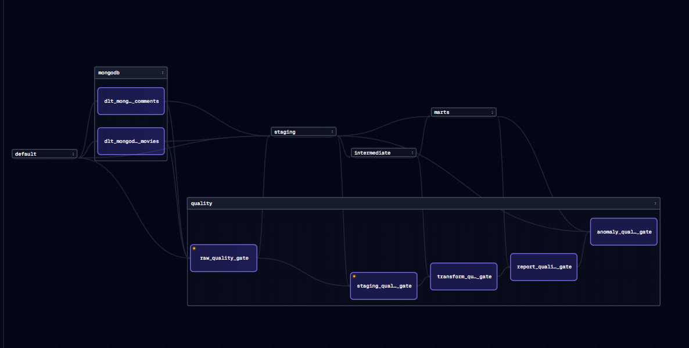
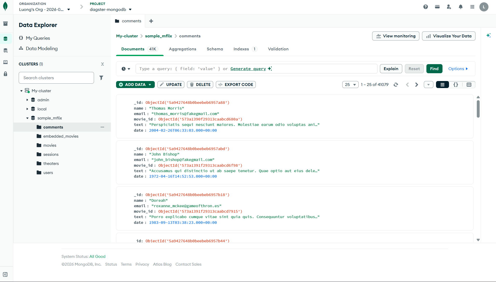
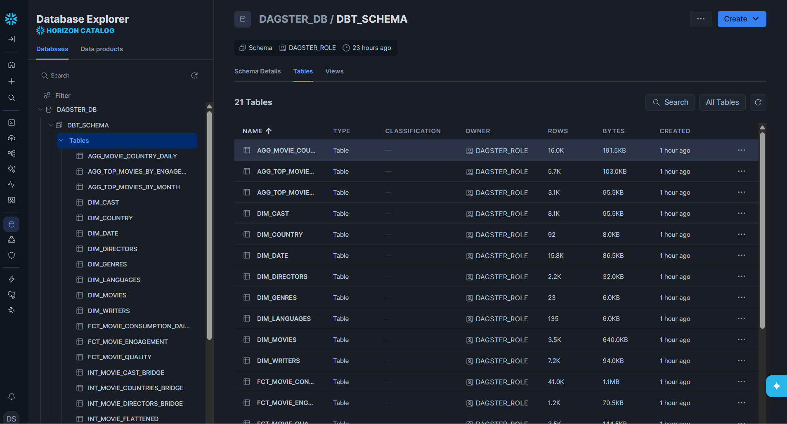

# 🎬 Nền tảng MFlix Analytics - Dagster + dlt + dbt + Snowflake

[](https://www.python.org/)
[](https://dagster.io/)
[](https://dlthub.com/)
[](https://www.getdbt.com/)
[](https://www.soda.io/)
[](https://www.snowflake.com/)
[](https://github.com/astral-sh/uv)

Một nền tảng dữ liệu end-to-end thực tiễn cho phân tích MFlix: ingestion từ MongoDB, lưu trữ trên Snowflake, modeling với dbt, kiểm soát chất lượng bằng Soda, và orchestration bằng Dagster với các luồng end-user cho ad-hoc, BI, và simple ML.

## 🖼️ Kiến trúc Hệ thống

Ảnh pipeline (render được trực tiếp trên GitHub):






## 🔧 Các Tính Năng Chính

- ELT từ đầu đến cuối: MongoDB -> dlt -> Snowflake -> dbt marts.
- Pipeline ưu tiên chất lượng với kiểm tra Soda và audit logs.
- Marts được hợp đồng hóa để downstream consumption ổn định.
- Các luồng end-user chuyên dụng:
  - báo cáo ad-hoc theo thể loại
  - snapshot KPI BI
  - dự báo rating đơn giản bằng ML hàng tháng
- Orchestration giống production sử dụng Dagster jobs và schedules.

## 📦 Output cho End Users

Các output được sinh ra và lưu vào thư mục `data/`:

- `data/ad_hoc_genre_interest_report.csv` - báo cáo ad-hoc theo thể loại
- `data/bi_kpi_snapshot.csv` - snapshot KPI cho BI
- `data/ml_monthly_rating_forecast.csv` - dự báo rating hàng tháng
- `data/movie_engagement.csv` - engagement của phim
- `data/top_movies_by_month.csv` - top phim theo tháng

## 📸 Quan sát Pipeline Chạy

Để xem pipeline hoạt động:

1. Khởi động Dagster UI tại http://localhost:3000.
2. Xem danh sách assets và DAG đầy đủ.
3. Chạy một job và giám sát thực thi.
4. Kiểm tra file CSV output trong thư mục `data/`.
5. Mở file Excalidraw để xem sơ đồ kiến trúc chi tiết.

## 🛠️ Chi Tiết Tech Stack

| Lớp | Công cụ | Mục đích |
| --- | --- | --- |
| Orchestration | Dagster | Assets, jobs, schedules, quan sát |
| Ingestion | dlt | Trích xuất MongoDB và load Snowflake |
| Warehouse | Snowflake | Lưu trữ phân tích tập trung |
| Transform | dbt | Modeling staging, intermediate, marts |
| Data Quality | Soda | Kiểm tra runtime và enforcement policy |
| Contracts | YAML + Python guards | MART schema/version governance |
| Analytics | pandas + scikit-learn | Ad-hoc BI/ML end-user outputs |
| Python Tooling | uv | Dependency và command execution |

## 📁 Cấu trúc Dự án

```text
dagster-mflix/
├── dagster_mflix/
│   ├── assets/                 # mongodb, dbt, quality, end_user assets
│   ├── jobs/                   # movies, transform, quality, ad_hoc, bi, ml jobs
│   ├── resources/              # dlt, dbt, snowflake resources
│   ├── partitions/
│   └── schedules/
├── mflix_snowflake/            # dbt project (staging/intermediate/marts)
├── soda/                       # soda checks và datasource config
├── data/                       # local output datasets cho end users
├── data_contracts/             # mart contracts + release notes
├── excalidraw/                 # Excalidraw diagram sources
└── dagster_mflix_tests/        # tests
```

## 🚀 Bắt đầu

### 1. Yêu cầu

- Python 3.11+
- uv
- Snowflake credentials
- MongoDB access (hoặc setup sample source)

### 2. Setup

```bash
git clone <your-repo-url>
cd dagster-mflix
uv sync
```

### 3. Biến Môi trường

Set ít nhất:

- `SNOWFLAKE_ACCOUNT`
- `SNOWFLAKE_USER`
- `SNOWFLAKE_PASSWORD`

Ví dụ .env:

```bash
SNOWFLAKE_ACCOUNT=xy12345.us-east-1
SNOWFLAKE_USER=user_name
SNOWFLAKE_PASSWORD=your_secret_password
```

## ⚙️ Chạy Nền tảng

### Khởi động Dagster

```bash
uv run dagster dev -m dagster_mflix
```

Sau đó mở http://localhost:3000 trong trình duyệt.

### Build dbt Models

```bash
cd mflix_snowflake
uv run dbt parse
uv run dbt build
```

### Chạy Dashboard Models (End-user)

```bash
cd mflix_snowflake
uv run dbt build --select dashboard_top_movies_monthly dashboard_engagement_daily dashboard_genre_trend_daily dashboard_rating_distribution
```

### Chạy End-user Jobs Trực tiếp (Không qua Orchestration)

```bash
# Ad-hoc genre report
uv run python -c "from dagster_mflix.assets.end_user import ad_hoc_genre_interest_report; ad_hoc_genre_interest_report()"

# BI KPI snapshot
uv run python -c "from dagster_mflix.assets.end_user import bi_kpi_snapshot; bi_kpi_snapshot()"

# ML monthly forecast
uv run python -c "from dagster_mflix.assets.end_user import ml_monthly_rating_forecast; ml_monthly_rating_forecast()"
```

Output sẽ được lưu vào thư mục `data/`.

## 🧪 Validation

```bash
uv run pytest -q
uv run pytest -q dagster_mflix_tests/test_data_contracts.py
```

## 📚 Tài liệu

- `data_contracts/mart_contracts.yml`
- `data_contracts/mart_contracts_release_notes.md`

## 🤝 Ghi Chú Presentation

Repository này được cấu trúc như một dự án data engineering production-grade:

- **README sẵn sàng portfolio** với các section kiến trúc, tính năng, và quick-start rõ ràng.
- **Folder `excalidraw/`** cho sơ đồ có thể chỉnh sửa.
- **Ba end-user jobs** (ad-hoc, BI, ML) thể hiện các pattern consumption downstream thực tiễn.
- **Quality-first design** với kiểm tra Soda và audit logs tại mỗi giai đoạn pipeline.
- **Contract governance** cho MART schemas với semantic versioning.

Hoàn hảo để thể hiện kiến thức modern data stack trong phỏng vấn hoặc presentation cho client.

